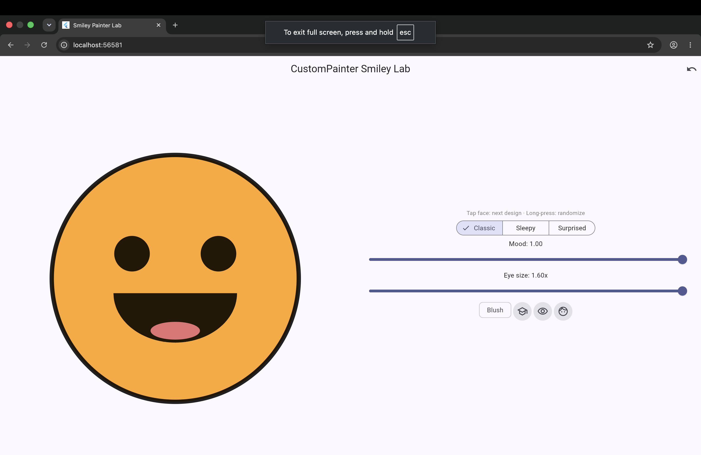
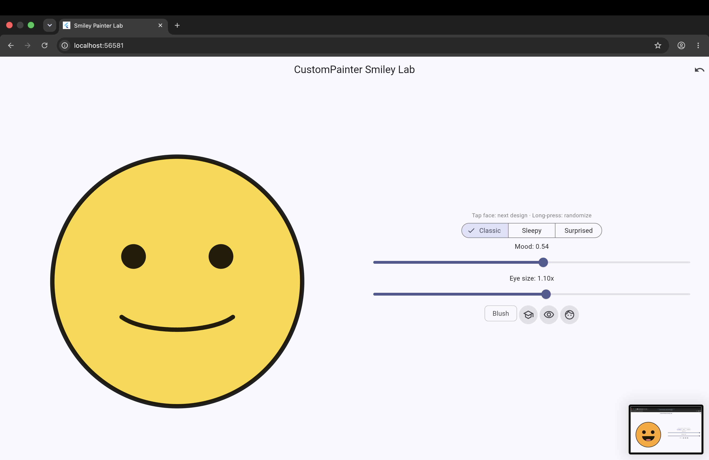
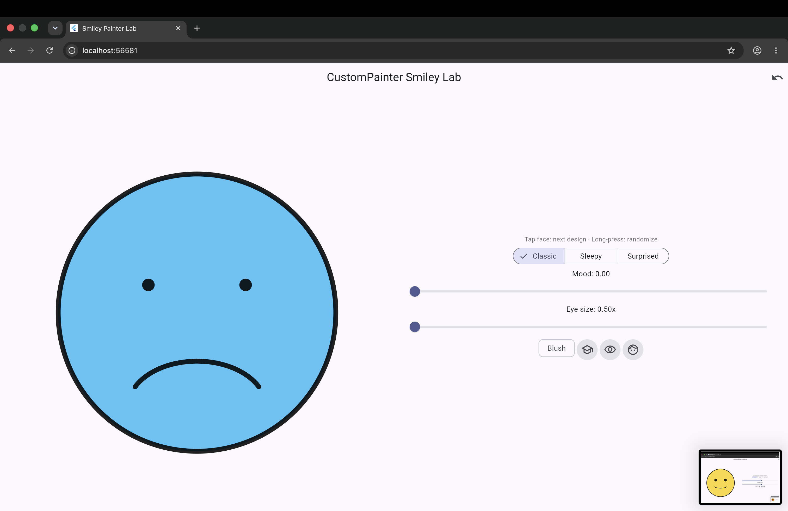
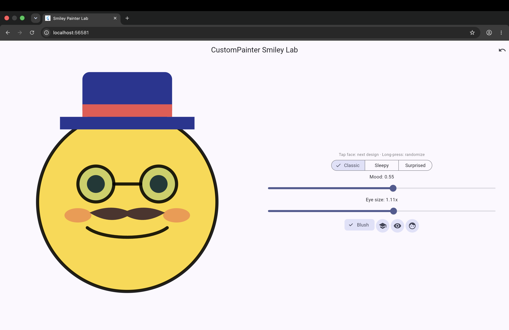
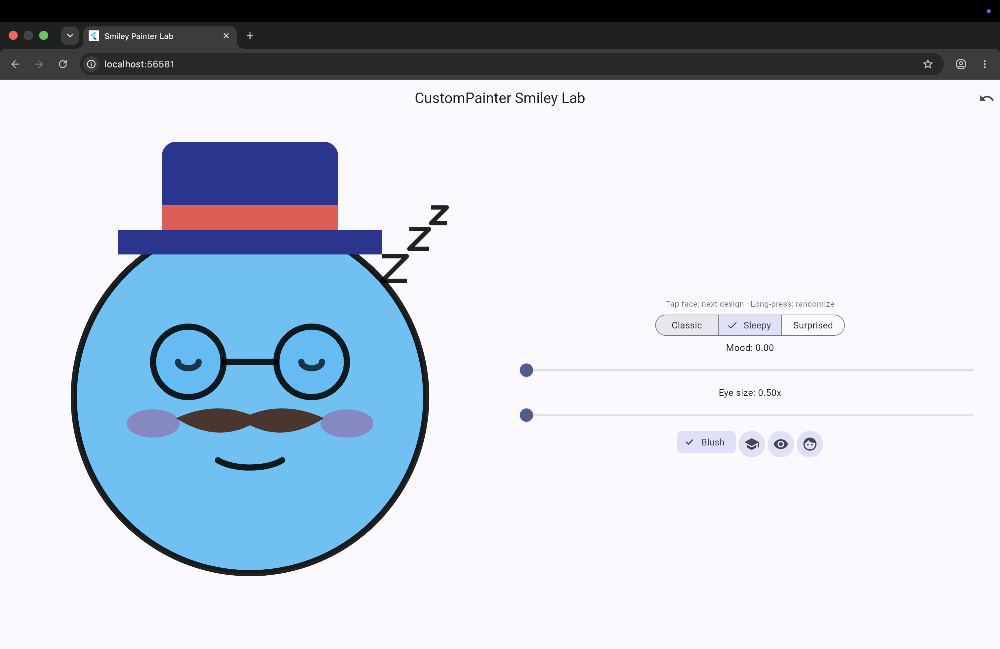
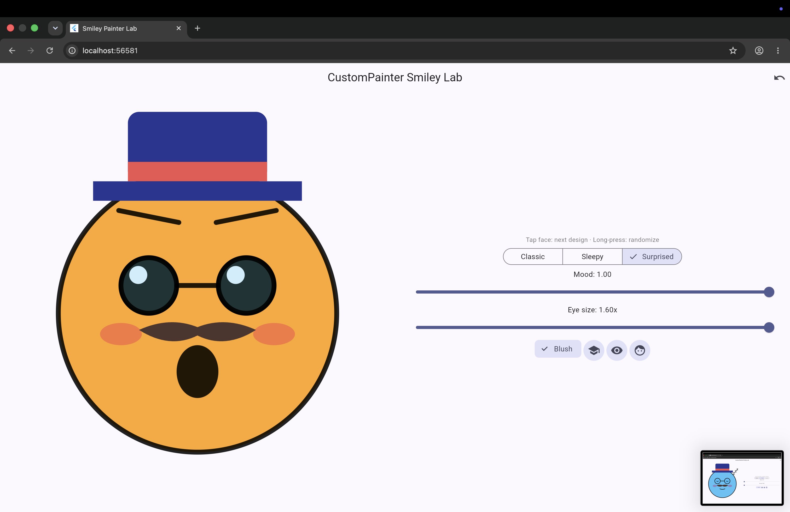

# Critical Thinking: Measure and Improve Your Smile Arc

**Student:** Preston Paris · **Activity:** In-Class Activity 06 · **Date:** September 30, 2026

My smile is built entirely from the canvas size: the face radius is `r = size.shortestSide * 0.36`, and the center is `(size.width / 2, size.height / 2)` shifted down by `r * 0.08` to leave room for the hat. For moods between 0.35 and 0.7, the mouth is a `Rect.fromCenter` at `center.dy + r * 0.2` with width `r * 1.0` and height `r * (0.15 + (mood - 0.35) * 1.2)`, drawn with `drawArc(mouthRect, 0.15 * pi, 0.70 * pi, false, stroke)`, which starts just below 3 o'clock and sweeps clockwise under the center so the arc stays centered and symmetric (screenshot 2). Below 0.35, a separate rect placed lower at `center.dy + r * 0.35` is drawn from `1.15 * pi` to make a frown (screenshot 3), and above 0.7 the mouth becomes a filled half-oval (`drawArc(rect, 0, pi, true, fill)`) for a big open smile (screenshot 1). The drawing is responsive because I replaced the starter's fixed 300×300 size with a `CustomPaint` sized from `constraints.biggest.shortestSide`, and every eye, mouth, and accessory position is a fraction of `r`, so in a wide window the face still fits fully and the layout switches to the face beside the controls. `shouldRepaint` returns true when `mood` (or any other painter input like face color, face type, eye size, or accessories) changes, because the old picture no longer matches the new values, and returns false when every input is the same so Flutter can reuse the last frame instead of redrawing it for nothing.

## Screenshots

| # | What it shows |
|---|---|
| 1 | Classic, mood 1.00: warm color and filled open smile |
| 2 | Classic, mood 0.54: yellow face and soft `drawArc` smile |
| 3 | Classic, mood 0.00: cool color and frown |
| 4 | Hat, glasses, mustache, and blush toggled on together |
| 5 | Sleepy face with closed-eye arcs and "Zzz" |
| 6 | Surprised face with big eyes and round open mouth |

